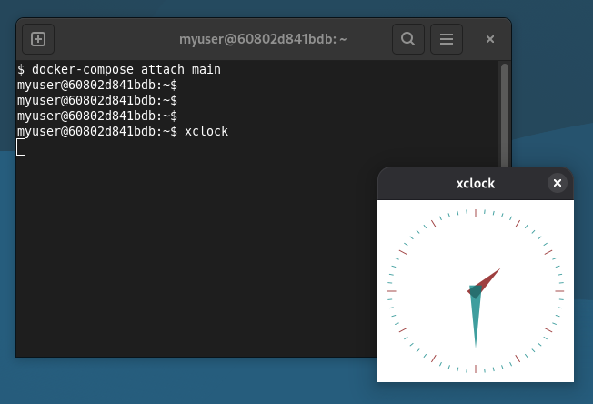

# guifwd

:whale: Run **graphical** (GUI) **applications** in a Docker container.

Both **Wayland** and **X11** are supported.

## Simple usage

The simplest way to try this image is:

```bash
docker run -it --rm \
    -v"${XDG_RUNTIME_DIR:?}/${WAYLAND_DISPLAY:?}:/opt/guifwd/host/wayland.sock:ro" \
    -v/tmp/.X11-unix/X0:/opt/guifwd/host/x11.sock:ro \
    -v"${XAUTHORITY:?}:/opt/guifwd/host/x11.xauth:ro" \
    dmotte/guifwd
```

> **Note**: it's not required to mount both the Wayland and X11 volumes; you can omit the ones you don't need or have.

> **Note**: this Docker image runs [userngo](https://github.com/dmotte/misc/tree/main/scripts/userngo) at startup to handle user creation and setup. See https://github.com/dmotte/misc/tree/main/scripts/userngo#examples for documentation and usage examples.

Then you can install and run some **graphical applications** inside the container:

```bash
sudo apt update && sudo apt install -y foot xterm x11-apps
foot
xterm
xclock
```



## Standard usage

The [`docker-compose.yml`](docker-compose.yml) file contains a complete usage example for this image. Feel free to simplify it and adapt it to your needs. Unless you want to build the image from scratch, comment out the `build: build` line to use the pre-built one from _Docker Hub_ instead.

To start the Docker-Compose stack in daemon (detached) mode:

```bash
docker-compose up -d
```

Then you can view the logs using this command:

```bash
docker-compose logs -ft
```

Then you can install and run some **graphical applications** inside the container: run `docker-compose attach main`, and see [above](#simple-usage) for examples.

## Development

See the [related section in the main README](/README.md#development).
